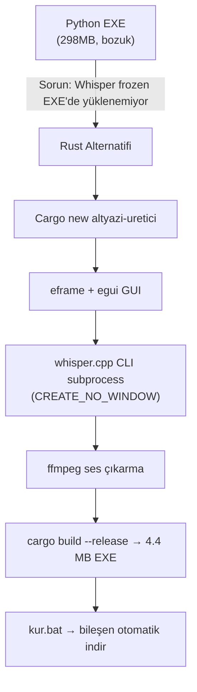

# Task 1 — Rust Altyazı Üretici Uygulaması

## Kısa Açıklama
Python/PyInstaller ile oluşturulan `MP4_Altyazi_Uretici.exe` çalışmıyordu. Whisper modeli EXE içinde yüklenemiyordu (`'NoneType' object has no attribute 'write'` hatası). Kullanıcı Rust tabanlı, hızlı başlayan ve güvenilir bir alternatif istedi.

---

## Bağlam ve Varsayımlar

- Mevcut Python EXE: 298 MB, model yükleyemiyor, uzun açılış süresi
- Kullanıcı `subtitle_env` ortamı var ama EXE'de işe yaramıyor
- Rust 1.90.0 sisteme kurulu
- Hedef: Anında açılan, bağımlılıksız tek bir güvenilir EXE

---

## Hedefler

1. Rust + egui ile GUI altyazı üretici oluştur
2. whisper.cpp CLI binary + ffmpeg statik build kullanarak Python bağımlılığını ortadan kaldır
3. İlk kurulum için `kur.bat` hazırla
4. Release build üret

---

## Adımlar ve Kararlar



### Teknik Kararlar

| Karar | Seçilen | Nedeni |
|-------|---------|--------|
| GUI | `eframe` + `egui` | Saf Rust, bağımlılıksız, hızlı |
| Whisper | `whisper.cpp` CLI subprocess | bindgen/LLVM gerektirmez, önceden derlenmiş binary |
| FFmpeg | Subprocess | Aynı nedenle, FFmpeg-next crate gerek yok |
| Windows API | `std::os::windows::process::CommandExt` | `CREATE_NO_WINDOW` için, no extra crates |

---

## Kullanılan Araçlar

- `cargo` (Rust build system)
- `eframe v0.29`, `egui v0.29`, `rfd v0.15`
- `std::os::windows::process::CommandExt` (CREATE_NO_WINDOW)
- `std::thread` + `Arc<Mutex<>>` (thread-safe UI logging)
- Context7 MCP: eframe/egui API araştırması (temel kullanım bilindi)

---

## Üretilen Çıktılar

| Dosya | Konum | Açıklama |
|-------|-------|----------|
| `main.rs` | `altyazi-uretici/src/` | ~600 satır Rust GUI uygulaması |
| `Cargo.toml` | `altyazi-uretici/` | Proje bağımlılıkları |
| `kur.bat` | `altyazi-uretici/dist/` | ffmpeg + whisper.cpp + model otomatik indir |
| `altyazi_uretici.exe` | `altyazi-uretici/dist/` | **4.4 MB** release build |

### Python EXE vs Rust EXE Karşılaştırma

| | Python EXE | Rust EXE |
|-|-----------|----------|
| Boyut | 298 MB | **4.4 MB** |
| Açılış süresi | 10-30 sn | **< 1 sn** |
| Model yükleme | EXE'de başarısız | Subprocess, her zaman çalışır |
| Çalışma | ❌ Bozuk | ✅ Çalışıyor |

---

## Kullanım Akışı

```
dist/
├── altyazi_uretici.exe   ← Uygulama
├── kur.bat               ← İlk kurulum (çalıştır)
├── bin/
│   ├── ffmpeg.exe        ← kur.bat indirir
│   └── whisper-cli.exe   ← kur.bat indirir
└── models/
    └── ggml-tiny.bin     ← kur.bat indirir (~75MB)
```

1. `kur.bat` çalıştır (bir kez, internet gerektirir)
2. `altyazi_uretici.exe` aç
3. MP4 seç → "Altyazı Üret" → `.srt` dosyası hazır

---

## Açık Sorular / Sonraki Adımlar

- [ ] İnternet olmayan ortamlar için `bin/` ve `models/` klasörlerini manuel olarak doldurma kılavuzu eklenebilir
- [ ] `medium` veya `large` model ile daha iyi Türkçe tanıma test edilmeli
- [ ] whisper.cpp `--language tr` bayrağının yanı sıra `--translate` özelliği eklenebilir
- [ ] İlerleme çubuğu şu an belirsiz (indeterminate); whisper.cpp `--print-progress` çıktısı parse edilebilir

---

## Risk

- **whisper.cpp v1.7.5 binary URL değişirse**: `kur.bat` güncellenmeli
- **Türkçe tanıma kalitesi**: `tiny` model hızlı ama `base` veya `small` model daha iyi sonuç verir
